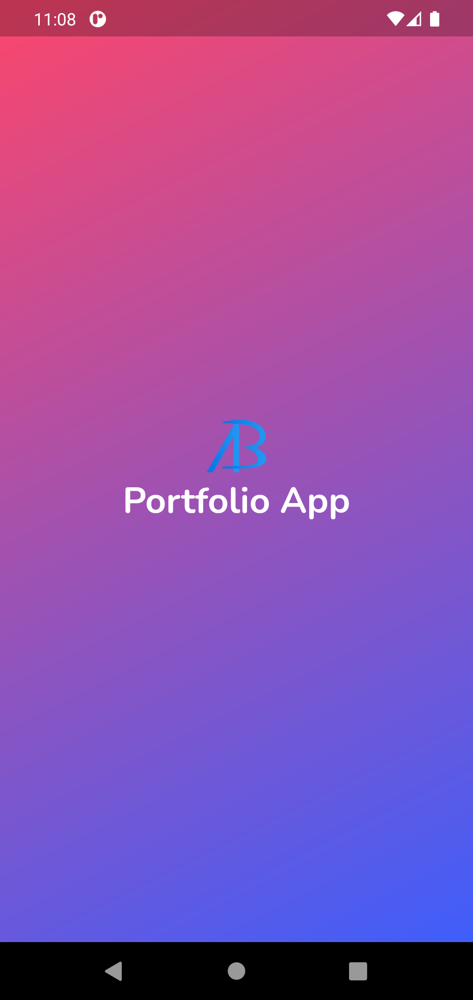

# Portfolio Application

A portfolio app for myself designed only for mobile devices. 
## 🎯 Features
- Attractive animating gradient background
- Animated like button using [like_button](https://pub.dev/packages/like_button) package
- Page transitions using [liquid_swipe](https://pub.dev/packages/liquid_swipe) package
## ✍ To dos
- [ ] Check and make app responsive for all screen sizes
- [ ] Connect with Firebase or other backend services for dynamic data
- [ ] Application testing

## 📱 Screenshots
&ensp;&ensp;&ensp;&ensp;&ensp;&ensp;&ensp;&ensp;&ensp;&ensp;&ensp;&ensp;
  
## 💻 Test application on your machine
Open CMD from where you want to clone the project & run the following commands:
```
  git clone https://github.com/x-abgth/portfolio_app.git
```
```
  cd portfolio_app
 ```
 ```
  flutter packages get
 ```
 ```
  flutter run
```
## ❤ Conclusion
🌟 Star this repo & follow for more 😊

<a href="https://www.buymeacoffee.com/abgth" target="_blank"></a>

